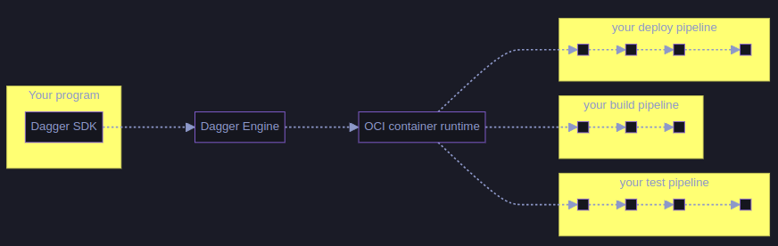
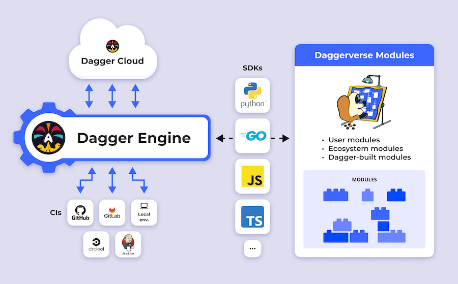

# dagger-poc

This repo shows how to use Dagger in both go and node to build a simple websocket node application, written in TypeScript with Express.

## How does it work?

1. Your program imports the Dagger SDK in your language of choice.
2. Using the SDK, your program opens a new session to a Dagger Engine: either by connecting to an existing engine, or by provisioning one on-the-fly.
3. Using the SDK, your program prepares API requests describing pipelines to run, then sends them to the engine. The wire protocol used to communicate with the engine is private and not yet documented, but this will change in the future. For now, the SDK is the only documented API available to your program.
4. When the engine receives an API request, it computes a Directed Acyclic Graph (DAG) of low-level operations required to compute the result, and starts processing operations concurrently.
5. When all operations in the pipeline have been resolved, the engine sends the pipeline result back to your program.
6. Your program may use the pipeline's result as input to new pipelines.

The Dagger Engine can be run in any CI and can easily run on local machine for easy testing before pushing.

## Running Dagger in github actions
The setup runs the 2 pipelines in the folder `ci`:
1. A Dagger pipeline written in [GoLang](ci/main.go) with 3 stages:
    - Test stage
    - Build Stage
    - Docker Publish stage
2. A Dagger pipeline written in [node](ci/index.mjs) with 3 stages:
    - Test stage
    - Build Stage
    - Docker Publish stage

Both of the pipelines are run when pushing to main branch as theres to workflows in the `.github` folder:
1. [Go Workflow](.github/workflows/go-pipeline.yaml)
1. [Node Workflow](.github/workflows/node-pipeline.yaml)

They both install `dagger sdk` and `dagger cli` to run the corrosponding pipeline.
This shows that the Dagger can run anywhere as long as docker is present.

## Running locally
1. Open the repositories devcontainer in Visual Studio Code.
2. Run `dagger run go run ci/main.go` for the go pipeline
3. Run `dagger run node ci/index.mjs` for the node pipeline